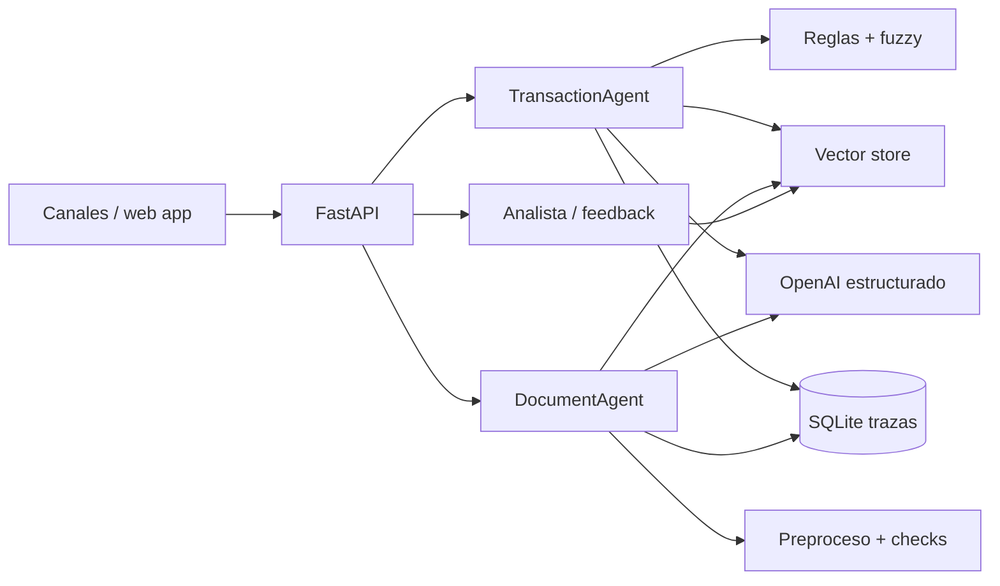

# Arquitectura

Ambos agentes aplican `perceive → enrich → reason → decide → log`. `MOCK_MODE=true` sustituye únicamente las llamadas externas; conserva reglas, checks, umbrales, trazabilidad y endpoints. Los identificadores se mantienen opacos en la descripción enviada al modelo.

